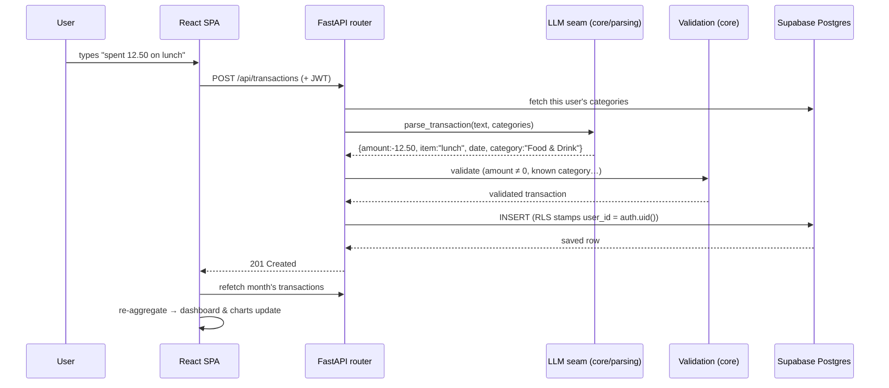

# Data Flow

To make the architecture concrete, here's a single common workflow traced from
keystroke to rendered chart: **a user adds an expense by typing plain English.**

> _"spent 12.50 on lunch"_

The key thing to notice — and a question interviewers like to ask — is **where
the AI runs.** It runs at *entry time, before the database write*, to turn text
into structured data. It is not a post-save "insight generator."

## The path



## Step by step

1. **Frontend capture.** The user types free text. The SPA sends it to
   `POST /api/transactions`. The Axios interceptor in `src/api/http.js`
   automatically attaches the Supabase session JWT as a `Bearer` token — no
   screen has to remember to do this.

2. **Auth becomes a database client.** The backend's `get_db` dependency turns
   the JWT into a *request-scoped* Supabase client
   (`core/db.py → user_client`). Every query this request makes runs **as that
   user**, so row-level security applies automatically.

3. **AI extraction (this is where the LLM runs).** The router calls
   `core/parsing.parse_transaction(text, categories)`. The parser builds a prompt
   that includes **today's date and the user's category list**, sends it through
   the active provider (Claude in prod, Ollama in dev), and extracts strict JSON:

   ```json
   { "date": "2026-07-10", "item": "lunch",
     "category": "Food & Drink", "amount": -12.50, "source": null }
   ```

   Passing the date and category list into the prompt is what lets *"yesterday"*
   resolve to a real date and *"lunch"* map to an existing category instead of a
   hallucinated one.

4. **Validation.** `core/validation.validate_transaction` enforces the rules the
   database also enforces (non-null item/date/amount, `amount ≠ 0`, category must
   be known). **Invalid parses are rejected, never silently stored.**

5. **Persistence.** The validated row is inserted. Because the insert runs on the
   per-user client, Postgres stamps `user_id = auth.uid()` by default and the RLS
   policy guarantees the row can only ever belong to this user.

6. **Dashboard refresh.** The SPA refetches the month's transactions and
   re-runs the pure aggregation helpers in `src/lib/aggregate.js`. The net-worth
   card, monthly bars, and category breakdown recompute from the new data. No AI
   is involved on this leg — it's deterministic math over the fresh rows.

## The same path, four front doors

The power of the `core/` boundary is that steps 3–5 are **identical** regardless
of entry point:

| Entry point | How step 1–2 differ | Steps 3–5 |
|---|---|---|
| Web SPA | JWT from the browser session | identical |
| Telegram bot | secret-verified webhook, server sets the personal `user_id` | identical |
| Statement PDF | multipart upload → rows extracted first, then parsed/categorised | identical |
| Gmail alerts | daily cron reads emails, parses them | identical |

Write the parsing-and-persistence path once; reuse it everywhere.

## A contrasting flow: AI *insights* are separate

The investment tab *does* generate AI analysis (bull/bear cases, news summaries),
but that's a **separate, on-demand, cached** flow — not part of adding an expense.
It's documented in the [AI pipeline](04-ai-pipeline.md#2-investment-analysis-on-demand--cached).
Keeping "AI at data entry" and "AI for analysis" as distinct flows is a
deliberate separation of concerns.
