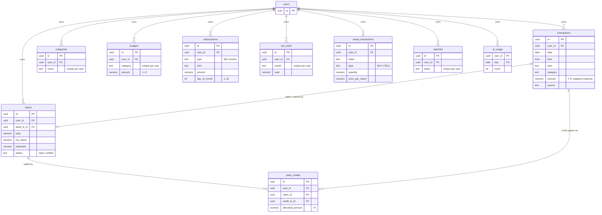

# Database Design

The database is **Supabase (PostgreSQL)**. Every design choice here serves two
goals: keep financial data *correct* (constraints the app can't bypass) and keep
each account's data *isolated* (enforced by the database, not by hoping the
application filters correctly).

## Entity-relationship diagram



## Tables

| Table | Purpose |
|---|---|
| `transactions` | The ledger. Every cash movement; `amount` sign encodes direction. |
| `categories` | Per-user category set (16 canonical categories seeded). |
| `budgets` | One recurring monthly budget per category. |
| `subscriptions` | Recurring bills and income, with a `day_of_month`. |
| `net_worth` | One user-entered cash "anchor" per month. |
| `claims` | A shared expense awaiting reimbursement. |
| `claim_credits` | Links reimbursement credits to the claim they pay down. |
| `invest_transactions` | BUY/SELL lots; holdings are derived from these. |
| `watchlist` | Tickers the user follows. |
| `ai_usage` | Per-user, per-day LLM call counter (powers the demo cap). |
| `investment_cache` | Keyed cache of external market-data and AI responses. |

## Relationships worth explaining

### Claims: computed at read time, not written to the ledger

Shared-expense claims are the most interesting relationship in the schema. When
you pay $100 for a group dinner and expect $75 back, the app does **not** write
phantom "someone owes me" rows into `transactions`. Instead:

- A `claims` row references the original **debit** transaction
  (`debit_tx_id → transactions`).
- As reimbursements arrive, each credit transaction is linked through
  `claim_credits` — a **many-to-many** join (one repayment can settle part of a
  claim; a claim can be settled by several repayments).
- A claim's `received` / `remaining` / `variance` are **pure functions** of its
  links (see `core/claims.py`). Its effect on reported spending and income is
  applied only when `status = 'settled'`.

This keeps the ledger honest — it records real money movements only — while the
claims layer models "who owes what" on top. The settlement math lives in
`core/claims.py` with no database dependency, so it's unit-tested in isolation.

### Net worth: anchors plus derived balances

`net_worth` stores just **one cash figure per month**. Balances for months
without an explicit entry are traced client-side from the nearest preceding
anchor plus cumulative net cash flow. Storing anchors instead of a full daily
balance history keeps the table tiny and avoids a class of "stale balance" bugs.

## Design rationale

**Amount sign convention.** A single `amount` column with *negative = expense,
positive = income* avoids a separate `type` column and makes aggregation a plain
`SUM`. A `CHECK (amount <> 0)` constraint blocks the meaningless zero-value row.

**Defense in depth.** Validation exists in three places on purpose: the frontend
(fast feedback), `core/validation.py` (the authoritative application rule), and
Postgres `CHECK`/`NOT NULL` constraints (the last line no code path can bypass).
A bug in one layer doesn't corrupt the data.

**Per-user uniqueness.** Uniqueness is scoped to the owner — `unique (user_id,
name)` on categories, `(user_id, category)` on budgets, `(user_id, month)` on
net worth. Two accounts can both have a "Groceries" category or a June anchor
without colliding.

## Authentication & row-level security

Isolation between the **personal** and **demo** accounts is enforced by the
database itself, defined in [`db/002_multi_tenant.sql`](../../db/002_multi_tenant.sql):

1. Every financial table has a `user_id uuid references auth.users(id)`, set to
   **`default auth.uid()`** and `NOT NULL`. The migration rolled this out
   backward-compatibly: add the column *nullable*, **backfill** existing rows to
   the personal account, then flip it to `NOT NULL` — so live data was never
   orphaned.
2. Every table has **row-level security enabled** with a single owner policy:

   ```sql
   create policy transactions_owner on transactions
     using (user_id = auth.uid())        -- which rows you can read
     with check (user_id = auth.uid());  -- which rows you can write
   ```

3. On the request path, the backend never uses a privileged connection. It builds
   a **request-scoped client authenticated with the caller's JWT**
   (`core/db.py → user_client`), so `auth.uid()` resolves to that user and the
   policy filters every query. A router literally *cannot* forget to add
   `where user_id = ...` — the database adds it.

4. **Trusted server jobs** (email cron, Telegram webhook, demo reset) are the
   only code that uses the service-role client, which bypasses RLS; those jobs set
   `user_id` explicitly to the correct account.

The **demo AI cap** rides on the same mechanism: `ai_usage (user_id, day, count)`
plus a `security definer` RPC, `increment_ai_usage()`, that atomically bumps the
caller's daily count. The backend rejects demo requests past 5/day; the personal
account is unlimited. → [AI pipeline](04-ai-pipeline.md)
