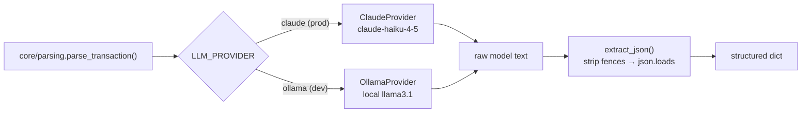
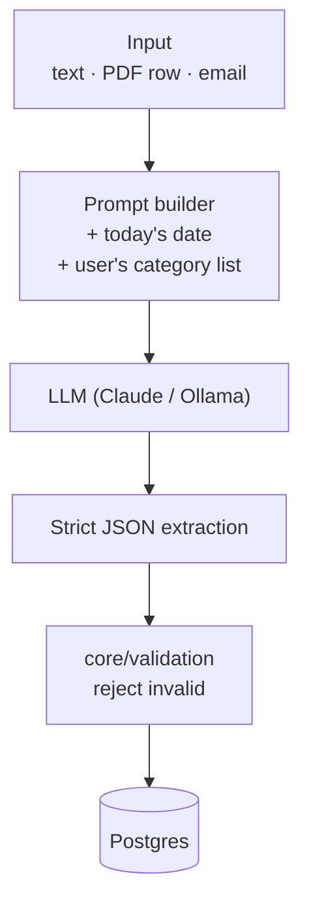
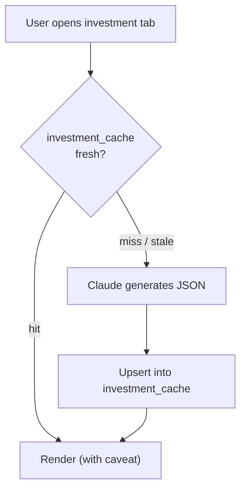

# AI Pipeline

AI is used in two distinct ways, and it's worth being precise about them because
they have different shapes and different constraints:

1. **Extraction** — turn unstructured input (free text, PDFs, emails) into
   validated, structured transactions. Runs **at data-entry time**, synchronously.
2. **Investment analysis** — generate bull/bear cases and news summaries.
   Runs **on demand** and is **cached**, behind a "not financial advice" caveat.

Both sit behind the same pluggable provider seam.

## The provider seam

A single environment variable, `LLM_PROVIDER`, selects the backend:

Every provider implements the same tiny interface — `complete(system, user) ->
str` — so callers never branch on which model is active. The provider is a lazily
constructed singleton chosen once at first use (`core/parsing/__init__.py`).

**Why this matters:** development runs fully offline on Ollama (no API cost, no
network), while production uses Claude for quality. Swapping providers, or adding
a third, changes *one file* and touches *zero* callers.

## 1. Extraction pipeline (at data entry)

This is the flow behind natural-language entry, Telegram messages, bank-statement
PDFs, and email alerts. The shape is always the same:

Three details make this reliable rather than flaky:

- **Context in the prompt.** The system prompt fixes the output schema
  (`date, item, category, amount, source`) and the user message injects **today's
  date** and the **available categories**. That's what lets *"yesterday"* resolve
  to a real date and *"lunch"* snap to an existing category rather than a made-up
  one.
- **Strict extraction.** `extract_json()` strips any markdown code fences and
  `json.loads()` the result; anything non-JSON raises rather than being guessed
  at. Ollama is additionally asked for `format: json` to keep it honest.
- **Validation is not optional.** The model's output is treated as *untrusted
  input*. It passes through `core/validation.py` (and ultimately DB constraints)
  before it can be stored. The LLM is a component with a contract, not an
  authority.

### Statement extraction is a two-step variant

Bank-statement import (`core/statement/`) splits the work: `extract_rows()` pulls
line items out of the PDF, then `categorize_rows()` asks the model to suggest a
category for each item in one batched call. The result is a list of *suggestions*
the user reviews before saving — the human stays in the loop for a bulk import.

## 2. Investment analysis (on demand & cached)

The investment tab generates two things with Claude (`claude-sonnet-5`): a
balanced **bull/bear case** from fundamentals + headlines, and a **holdings-news
summary**. This flow is deliberately different from extraction:

- **Cached, with TTLs.** Bull/bear analysis is cached for 7 days, news summaries
  for 24 hours (`core/investments/`). Analysis doesn't change minute to minute, so
  caching cuts cost and latency dramatically.
- **Always caveated.** The UI renders every AI-generated section behind a visible
  *"AI-generated, not financial advice"* label. This is decision support, not a
  recommendation engine.

## Cost control: the demo cap

Because the demo account is public, its AI usage is capped at **5 calls/day**.
Each gated endpoint depends on `enforce_ai_limit`, which calls the atomic
`increment_ai_usage()` RPC and returns HTTP 429 once the demo account passes the
limit. The personal account is exempt. → [database](03-database-design.md#authentication--row-level-security)

## What's intentionally *not* here (yet)

There is **no conversational "ask a question" agent** today. A Claude tool-use
agent that answers *"how am I doing this month?"* is on the
[roadmap](06-design-decisions.md#accepted-trade-offs) — it's called out here so
the documentation matches what actually ships.
