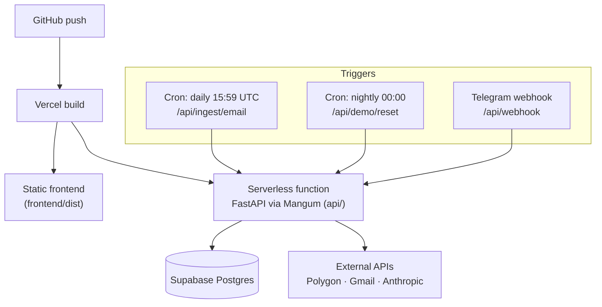

# Deployment

The whole system deploys as a **single Vercel project**: a static frontend and a
serverless FastAPI function, plus scheduled cron jobs and an inbound webhook, all
talking to Supabase.



## One app, two runtimes

The same FastAPI application runs in two environments without code changes:

- **Locally** under Uvicorn (`uvicorn backend.main:app --reload`).
- **In production** as a Vercel serverless function. `api/` wraps the app with a
  **Mangum** ASGI adapter that translates serverless invocations into ASGI calls.

`vercel.json` ties it together: it builds the frontend, serves `frontend/dist`,
rewrites `/api/*` to the serverless function, and falls back to `index.html` for
client-side routes.

```jsonc
{
  "buildCommand": "cd frontend && npm install && npm run build",
  "outputDirectory": "frontend/dist",
  "rewrites": [
    { "source": "/api/(.*)", "destination": "/api/index" },
    { "source": "/(.*)",     "destination": "/index.html" }
  ],
  "crons": [
    { "path": "/api/ingest/email", "schedule": "59 15 * * *" },
    { "path": "/api/demo/reset",   "schedule": "0 0 * * *" }
  ]
}
```

## Scheduled jobs

Serverless functions are stateless and short-lived, so recurring work is pushed
to **Vercel cron**, which simply hits an endpoint on a schedule:

| Schedule | Endpoint | What it does |
|---|---|---|
| `59 15 * * *` (daily) | `/api/ingest/email` | Reads DBS bank-alert emails from Gmail and logs them to the **personal** account with zero manual entry. |
| `0 0 * * *` (nightly) | `/api/demo/reset` | Wipes and reseeds the **demo** account to a fresh baseline. |

Both endpoints are protected: cron requests must present the `CRON_SECRET` as a
bearer token, so the endpoints can't be triggered by the public.

## Webhooks

The Telegram bot uses a **webhook, not polling**. Telegram POSTs each message to
`/api/webhook`, and the handler verifies a secret token before accepting it. On a
serverless platform this is the natural fit — there's no always-on process to run
a polling loop, and a webhook does zero work until a message actually arrives.
→ [why webhooks over polling](06-design-decisions.md#why-webhooks-instead-of-polling)

## Secrets & configuration

Everything environment-specific is an environment variable (see `.env.example`):

| Secret | Guards |
|---|---|
| `SUPABASE_SERVICE_KEY` | Server-only, RLS-bypassing client for trusted jobs. |
| `CRON_SECRET` | Authenticates Vercel cron calls. |
| `TELEGRAM_WEBHOOK_SECRET` | Verifies inbound Telegram webhooks. |
| `ANTHROPIC_API_KEY` | LLM access in production. |
| `ALLOWED_ORIGINS` | CORS allow-list for the API. |

The frontend only ever receives the public anon key and demo credentials — every
privileged operation happens server-side behind the service key.

## Data layer

**Supabase** hosts Postgres and issues the JWTs used for auth. Applying the schema
is a one-time step: run `db/schema.sql` then `db/002_multi_tenant.sql` in the
Supabase SQL editor. Row-level security means the same database safely serves both
the private personal account and the public demo.
→ [database design](03-database-design.md)
