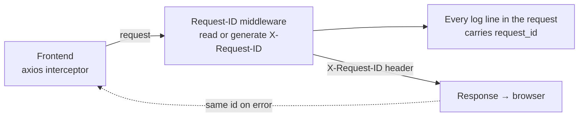

# Observability

Being able to run software is not the same as being able to *operate* it. This
layer answers the operational questions: *Is it up? What happened during that
failed request? Did anything crash?* — while holding to a strict privacy stance.

## Guiding principle: local-first, opt-in

The project is designed so anyone can clone and self-host it with their data on
their own machine. Observability must not quietly undermine that. The rule:

> **Log to stdout, report to nothing by default, and make every external service
> opt-in via an environment variable.**

That single principle serves two audiences without conflict:

| Audience | What they get | Where data goes |
|---|---|---|
| **Self-hoster** (clones the repo) | Structured logs on their own machine, a health endpoint they own | Nowhere — stays local |
| **Maintainer** (demo deployment) | Full error tracking by setting one env var | Their own GlitchTip instance |

Nothing leaves a self-hoster's machine unless they explicitly choose it.

## A serverless constraint that shaped the design

Vercel functions are **ephemeral** — no persistent local log files, no sidecar
agents, no Prometheus scraping a long-lived process. So observability here is
**stdout- and push-based, never pull-based**. Vercel captures stdout
automatically; a self-hoster pipes it to a file, Docker logs, or journald.

## Logging & request correlation

Every backend event is a **structured log line** (`structlog`): pretty coloured
output in development, machine-readable JSON in production, selected by an env
var. The important part is **correlation** — one ID ties a whole request together
across the stack:

When a request fails, the same `request_id` appears in the browser's normalized
error *and* in every server log line for that request — so a single ID is enough
to reconstruct exactly what happened. (`core/logging.py`,
`backend/main.py` middleware, `frontend/src/api/http.js`.)

## Error handling that fails safely

- **Backend global handler** — any unhandled exception is logged in full *with the
  request ID and stack trace*, but the client only ever receives
  `{"detail": "Internal error", "request_id": "<id>"}` with HTTP 500. Internals
  are never leaked. The existing `ValidationError → 422` handler is preserved as
  the expected-error path; this is the catch-all.
- **Frontend error boundary** — a React `ErrorBoundary` wraps the router, so one
  crashing component shows a friendly fallback with a reload button instead of a
  blank white screen.
- **Frontend error normalization** — the Axios response interceptor collapses
  every API error into a consistent shape (message + request ID) for the UI, and
  signs the user out on a 401.

## Health & monitoring

- `GET /health` — **liveness**, always 200. Point an external uptime monitor here.
- `GET /health/ready` — **readiness**, runs a lightweight Supabase query; 200 when
  the database is reachable, 503 otherwise. This is what a deployment platform
  pings before routing traffic.
- **Error tracking (opt-in)** — `sentry-sdk` initializes in `core/logging.py`
  **only when `SENTRY_DSN` is set**, and the frontend browser SDK only when
  `VITE_SENTRY_DSN` is set. The DSN points at **GlitchTip** (self-hostable,
  Sentry-SDK-compatible), so even the recommended default keeps error data on
  infrastructure you own. Ship empty → send nothing.

## Why this matters

None of this is required to make the app *work* — it's what makes it *operable*
and *trustworthy*. Correlated logs turn "it broke" into a searchable ticket
number; the fail-safe error handler means a bug never leaks a stack trace to a
user; and the opt-in model means privacy is the default, not an afterthought.
That's the difference between code that runs and software you can run in front of
other people. → [design decisions](06-design-decisions.md)
