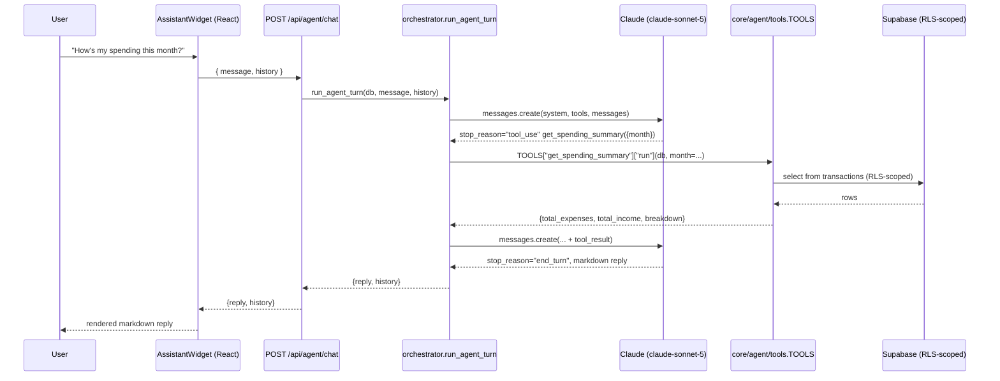

# AI Agent

The [AI pipeline](04-ai-pipeline.md) covers AI that runs *for* the user —
extraction at entry time, cached investment analysis. This is different: a
**conversational agent** the user talks to directly, that decides for itself
which of the app's own data lookups it needs in order to answer.

> _"How's my spending this month?"_ → the model calls `get_spending_summary`,
> reads the result, and writes the answer — no page navigation, no reading a
> chart.

## Shape: a tool-use loop, not a bigger prompt

The naive version of this feature is one large prompt that tries to describe
the user's finances in text. That doesn't scale and it hallucinates numbers.
Instead the model is given **tools** — typed functions it can invoke — and a
loop that executes whatever it asks for and feeds the result back:

The critical thing to notice: **Claude decides which tool to call, the
orchestrator just executes it.** `run_agent_turn` (`core/agent/orchestrator.py`)
has no branching logic about *what the user is asking* — it's a fixed loop,
capped at `MAX_TOOL_ITERATIONS = 5`, that:

1. Sends the conversation + tool specs to Claude.
2. If `stop_reason != "tool_use"`, returns the text — done.
3. Otherwise, looks up each requested tool by name in the `TOOLS` dict and
   calls its `run(db, **input)` **locally, synchronously, in Python** (a plain
   dict dispatch — no second model call is involved in "picking" the tool).
4. Appends the tool's JSON result as a `tool_result` message and goes back to
   step 1, so Claude can call another tool or write the final answer.

This keeps the model's reasoning and the app's data access cleanly separated:
Claude never sees a connection string or writes SQL, it only ever sees the
JSON a tool chooses to return.

## The tool registry

`core/agent/tools.py` defines five **read-only** tools, each a thin wrapper
around logic that already existed for the REST API — the agent doesn't
duplicate business logic, it re-exposes it:

| Tool | Wraps | Returns |
|---|---|---|
| `get_spending_summary` | `core.calc.monthly_summary` | income, expenses, net, per-category breakdown for a month |
| `get_budget_status` | `core.calc.budget_status` | each category's spend vs. budget, with on/watch/over |
| `get_savings_goal_progress` | `core.savings.goal_progress` | each goal's target, contributed-so-far, percentage |
| `analyze_stock` | Finnhub + FMP clients | company profile, financial ratios, recent headlines for a ticker |
| `get_portfolio_holdings` | `core.investments.positions` | live holdings, cost basis, return, portfolio totals |

Each entry pairs a `description` / JSON-Schema `input_schema` — the only
things Claude ever sees — with a `run` function the orchestrator calls
directly. A tool's *description* is the entire interface contract with the
model, so it's written to be explicit about units and defaults (e.g.
`get_budget_status`'s month parameter documents that it "defaults to the
current month").

**Every tool runs on the request-scoped `db` client**, the same
`user_client` used by the REST routers (→ [database](03-database-design.md#authentication--row-level-security)).
The agent doesn't get its own privileged access — a `select *` inside a tool
is filtered by the same row-level-security policy as everything else, so
there's no way for a tool (or a model asked to misuse one) to read another
user's data.

## Grounding: dates and history

Two details keep answers accurate instead of plausible-sounding:

- **The model is told never to guess.** The system prompt is explicit:
  *"Always call a tool to look up real numbers instead of guessing or
  recalling from earlier in the conversation."* Numbers in a finance app are
  the one thing that can't be approximated.
- **Relative dates are resolved once, at conversation start.** `"this month"`
  or `"last week"` are meaningless to a stateless API call, so the *first*
  user message in a new conversation is prefixed with the current date in
  Singapore time before it ever reaches Claude (`_with_date_context`,
  `orchestrator.py`). Later turns don't re-inject it — it's already anchored
  in the message history the client resends every turn.

## State: the client holds history, the server holds nothing

There is no `agent_conversations` table. `AssistantWidget.jsx` keeps
`messages` (for rendering) and `history` (the raw Claude message list) in
React state; every request sends the full `history` back, and the response's
updated `history` replaces it. This mirrors the rest of the app's
request-scoped, share-nothing backend — no session affinity, nothing to clean
up, and it costs nothing extra since Vercel functions are stateless already
(→ [deployment](05-deployment.md)). The trade-off is explicit: refresh the
page and the conversation is gone.

## Cost control

The chat endpoint sits behind the same `enforce_ai_limit` dependency as every
other AI route (`POST /api/agent/chat`, `backend/routers/agent.py`) — the demo
account is capped at 5 calls/day via the atomic `increment_ai_usage()` RPC,
the personal account is unlimited (→ [AI pipeline](04-ai-pipeline.md#cost-control-the-demo-cap)).
On top of that, `MAX_TOOL_ITERATIONS` bounds the worst case: a confused loop
that keeps calling tools still terminates in at most 5 model calls per user
turn, not an unbounded chain.

## Error handling

`anthropic.APIStatusError` (rate limits, credit exhaustion) is caught at the
one call site and turned into a plain-language reply — *"I'm rate-limited
right now — try again tomorrow"* — with the **conversation history rolled
back to before the failed turn**, so a transient provider error doesn't
corrupt what the client resends next time. The frontend has its own fallback
for the same case (`AssistantWidget.jsx` checks for HTTP 429).