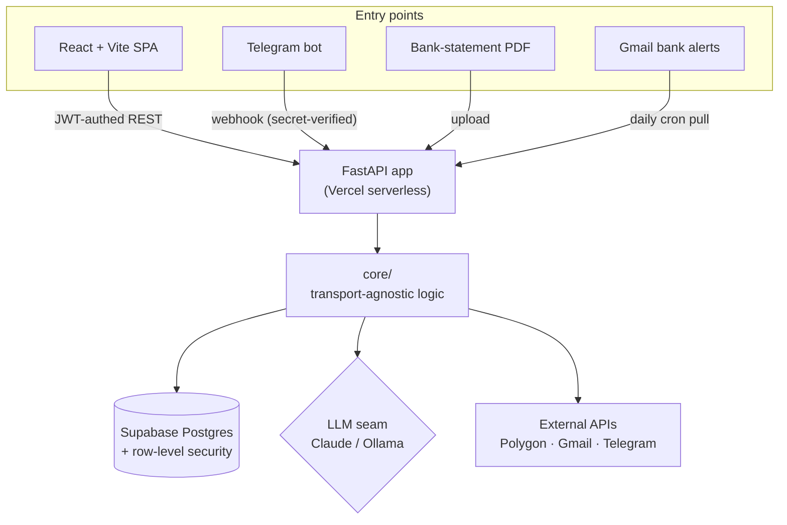

# Architecture & Technical Documentation

A deep-dive into how **Finance Tracker** is built and *why* it is built that way.

> **Who this is for.** This is an engineering-level walkthrough for reviewers,
> interviewers, and anyone curious about the internals. If you just want to know
> what the app *does*, start with the [root README](../../README.md). If you want
> to know how it *works*, you're in the right place.

## How to navigate

Read top-to-bottom for the full picture, or jump to a topic:

1. [Repository structure](01-repository-structure.md) — why each folder exists.
2. [Data flow](02-data-flow.md) — one request traced end-to-end.
3. [Database design](03-database-design.md) — schema, relationships, and RLS.
4. [AI pipeline](04-ai-pipeline.md) — how the LLM turns text/PDFs into data.
5. [Deployment](05-deployment.md) — GitHub → Vercel → cron → webhooks → DB.
6. [Design decisions](06-design-decisions.md) — the trade-offs and the reasoning.

---

## End-to-end development

This project was built to practice **owning every layer** of a product, from
requirements to deployment. Each stage below links to where it's documented.

| Stage | What I did |
|---|---|
| **Requirements** | Defined the core features (expense tracking, budgets, analytics, AI insights) and the user flows for each. |
| **System design** | Designed a two-tier architecture (React SPA + FastAPI) with a transport-agnostic `core/` layer. → [structure](01-repository-structure.md) |
| **Frontend** | Built a responsive React + Vite SPA with client-side routing, charts, and session-based auth. |
| **Backend** | Developed a FastAPI REST API, JWT auth, and business logic split into thin routers over a pure `core/`. → [data flow](02-data-flow.md) |
| **Database** | Modeled financial data in Postgres with per-user ownership and row-level security. → [database](03-database-design.md) |
| **AI integration** | Added a pluggable LLM layer for natural-language entry, statement parsing, and investment analysis. → [AI pipeline](04-ai-pipeline.md) |
| **Deployment** | Deployed serverless on Vercel with two scheduled cron jobs and a Telegram webhook. → [deployment](05-deployment.md) |
| **Testing** | Covered parsing, validation, settlement math, and every router with pytest + Vitest. |
| **Future work** | Identified next steps: CI/CD, structured monitoring, containerization, an AI agent. → [decisions](06-design-decisions.md#accepted-trade-offs) |

---

## Overall system

Four independent entry points feed **one shared validation + persistence layer**.
The business logic in `core/` doesn't know or care how the data arrived.

---

## Subsystems at a glance

**Frontend** — A React 18 SPA built with Vite. Client-side routing (React Router),
charts (Recharts), and an Axios layer that attaches the Supabase session JWT to
every request. Pure helpers (aggregation, formatting, claim math) live in
`src/lib`. → [structure](01-repository-structure.md)

**Backend** — A FastAPI app whose `routers/` are a thin HTTP layer over `core/`.
Every user-facing route runs against a request-scoped Supabase client so the
database enforces per-user access. → [data flow](02-data-flow.md)

**Database** — Supabase (PostgreSQL). Every financial table carries a `user_id`
and is protected by a row-level-security policy, so isolation is enforced by the
database, not by application code. → [database](03-database-design.md)

**Authentication** — Supabase Auth issues JWTs. The frontend sends the token; the
backend hands it to a request-scoped client so Postgres evaluates
`user_id = auth.uid()` on every row. → [database](03-database-design.md#authentication--row-level-security)

**AI services** — A pluggable seam (`LLM_PROVIDER`) swaps Anthropic Claude (prod)
and local Ollama (dev) behind one interface. Used for natural-language entry,
bank-statement extraction, and cached investment analysis. → [AI pipeline](04-ai-pipeline.md)

**Cron jobs** — Two Vercel cron schedules: a daily job that ingests bank-alert
emails, and a nightly job that resets the public demo account.
→ [deployment](05-deployment.md#scheduled-jobs)

**Webhooks** — A Telegram bot posts to a secret-verified webhook so transactions
can be logged from a phone. → [deployment](05-deployment.md#webhooks)

**Deployment** — One FastAPI app runs locally under Uvicorn and on Vercel via a
Mangum ASGI adapter; the frontend ships as static assets from the same build.
→ [deployment](05-deployment.md)
